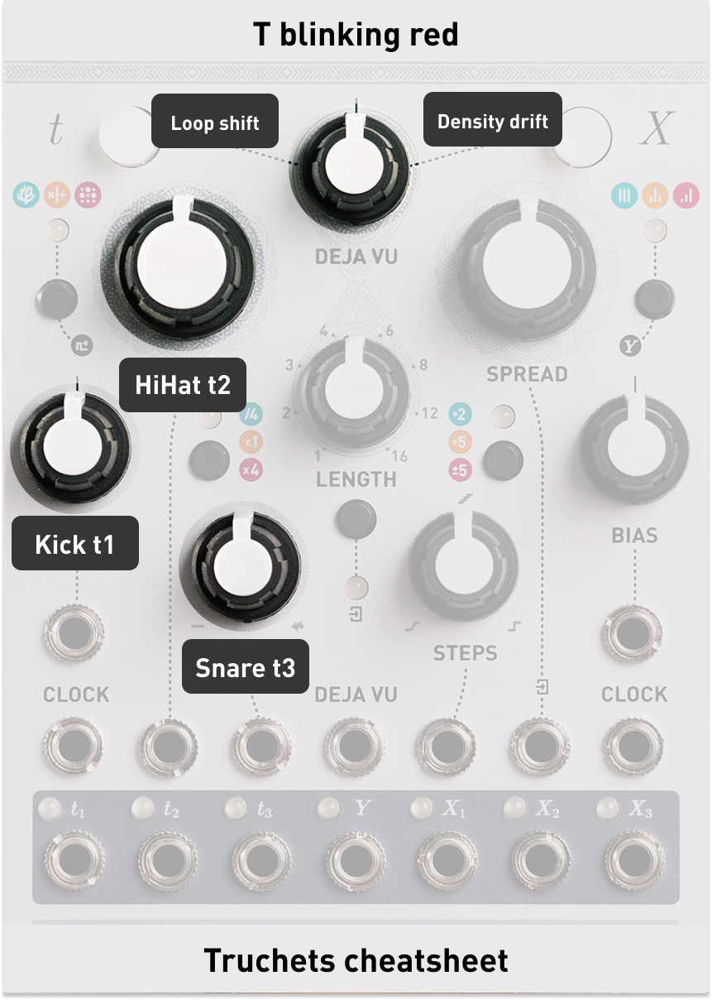
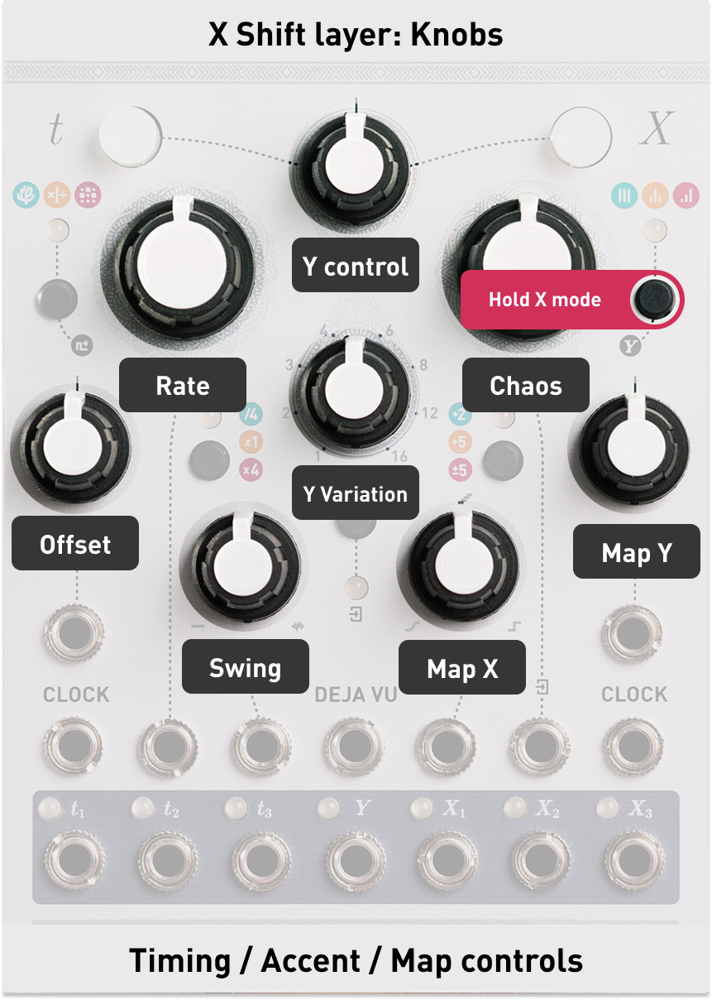
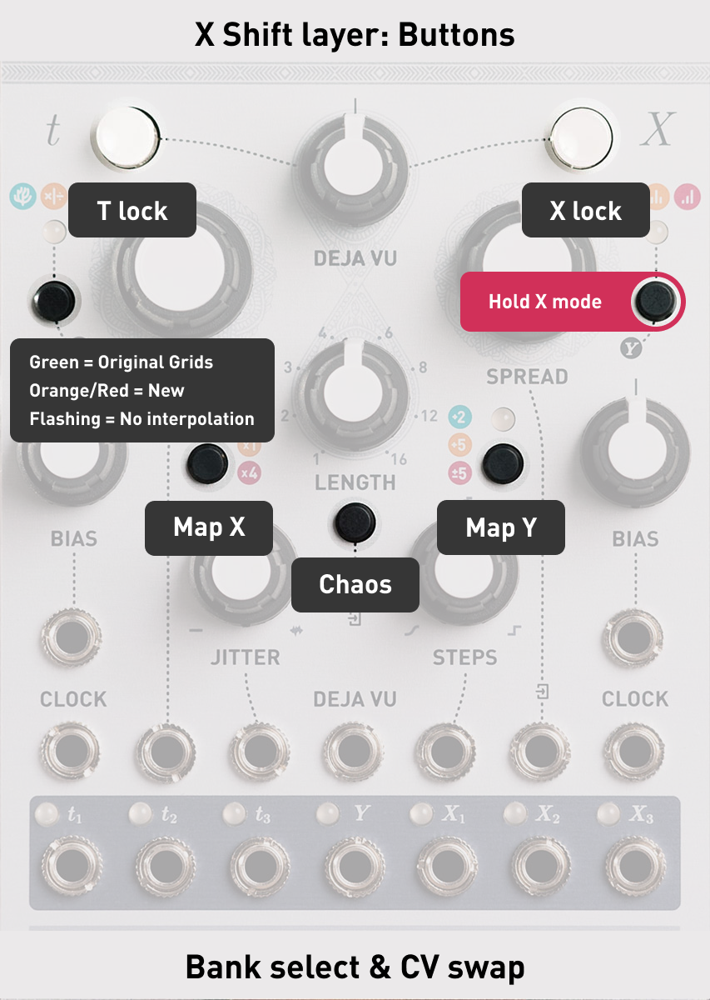
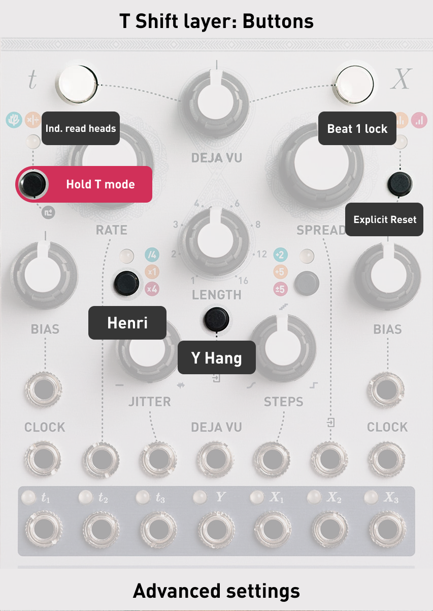

# Mutable Instruments - Marbles: Truchets

A reimagining of Mutable Instruments [**_Grids_**](https://pichenettes.github.io/mutable-instruments-documentation/modules/grids/) drum pattern generator, now living inside Marbles. Truchets is built on [**_Marbles 1.3_**](https://pichenettes.github.io/mutable-instruments-documentation/modules/marbles/firmware/). All other modes still function the same as in the original firmware.

  

## Activating Grids Mode

Long press **T Mode** while on drum mode (solid red) to enter Grids mode (blinking red).

> To exit long press **T Mode** without changing anything in the advanced layer.

## Outputs

| Output | Function |
|--------|----------|
| **T1** | Kick trigger |
| **T2** | Hi-hat trigger |
| **T3** | Snare trigger |
| **Y** | Accent output |
| **X1/X2/X3** | Random voltages |

  

## Standard Controls

### Density Knobs

| Knob | Controls |
|------|----------|
| **Bias (T)** | Kick density |
| **Rate** | Hi-hat density |
| **Jitter** | Snare density |

> All three respond to CV input.

### Deja Vu (T Side)

The Deja Vu section controls pattern looping:

- **T Deja Vu Button**: Tap to toggle loop lock on/off
- **Deja Vu Length**: Sets loop length (when locked)
- **Deja Vu Amount**: Controls loop behavior (see below)

#### Deja Vu Amount Behavior

| Direction | Effect |
|-----------|--------|
| **Left of noon** | Chance to shift loop start point +1 step each cycle |
| **Noon** | Neutral - no variation |
| **Right of noon** | Chance for density drift on steps (clears when unlocked) |

> When the knob is fully left or right the chance is 100%.

  

## Y Shift Layer - Knobs

**Hold X Mode** and turn knobs to access hidden parameters.

| Hold X Mode + Turn | Controls |
|--------------------|----------|
| **Bias (T)** | Groove offset |
| **Rate** | Rate |
| **Jitter** | Swing |
| **Steps** | Map X |
| **Bias (X)** | Map Y |
| **Spread** | Chaos |
| **Deja Vu Amount** | Accent control |
| **Deja Vu Length** | Accent variation |

### Groove Offset

| Position | Effect |
|----------|--------|
| **Far left** | Kick +3 steps late |
| **Center left** | Kick +1 and +2 steps late |
| **Left** | Kick micro-timing late (up to 50%) |
| **Noon** | Neutral (on beat) |
| **Right** | Snare micro-timing late (up to 50%) |
| **Center right** | Snare +1 and +2 steps late |
| **Far right** | Snare +3 steps late |

### Rate

The same Rate/tempo control from the standard Marbles interface, moved here to free up the knob for hi-hat density.

### Swing

| Position | Effect |
|----------|--------|
| **Left** | Paired swing - classic shuffle |
| **Noon** | No swing |
| **Right** | Triplet swing |

> Both swings go to 50% max

### Map X & Map Y

Change the pattern coordinates on the current bank. 

> [Original Grids manual](https://pichenettes.github.io/mutable-instruments-documentation/modules/grids/manual/)

### Chaos

| Position | Effect |
|----------|--------|
| **Left** | Random tempo jitter (humanize) |
| **Noon** | No chaos |
| **Right** | Density chaos (ghost notes / fills) |

> The left side of the chaos knob uses the normal Jitter logic from the other modes.

### Accent Control

| Position | Effect |
|----------|--------|
| **Far left** | Kick accent only |
| **Left** | Hi-hat accent only |
| **Center-left** | Snare accent only |
| **Noon** | All accents combined |
| **Right to far right** | All accents combined, lowering threshold |

> 192 is the original grids threshold for an accent and is used on the left to noon side of the knob.

> Lowering threshold creates more gates. If accent control is fully to the right an accent will always be fired when any of the outputs are firing.

### Accent Variation

| Position | Effect |
|----------|--------|
| **Left** | Random voltage window (1V-5V at far left, 4.9V-5V near noon) |
| **Noon** | Standard 5V gates |
| **Right** | Velocity-sensitive gates (voltage follows accent level) |

  

## Y Shift Layer - Buttons

**Hold X Mode** and press buttons to access CV routing and settings.

### Pattern Banks

Hold **X Mode** + tap **T Model** to cycle through pattern banks:

| LED State | Bank |
|-----------|------|
| Solid Green | OG Grids |
| Solid Orange | Electronic |
| Solid Red | Breakbeat |
| Blinking Green | OG Grids (no interpolation) |
| Blinking Orange | Electronic (no interpolation) |
| Blinking Red | Breakbeat (no interpolation) |

> **Interpolation vs No Interpolation:** With interpolation (solid LED), patterns morph smoothly between the 25 positions in the 5x5 grid as you adjust Map X/Y. Without interpolation (blinking LED), Map X/Y snap to the nearest of the 25 grid positions — no morphing, just the raw patterns.

### CV Swap Routing

| Hold X Mode + Press | LED State | CV Source |
|---------------------|-----------|-----------|
| **T Range** | Off | No CV |
| | Green | Steps CV → Map X |
| | Blinking | Bias (T) CV → Map X |
| **X Ext** | Off | No CV |
| | Green | Spread CV → Chaos |
| | Blinking | Rate CV → Chaos |
| **X Range** | Off | No CV |
| | Green | Bias (X) CV → Map Y |
| | Blinking | Jitter CV → Map Y |

> The routing follows a left-to-right logic across the panel. The buttons (center) map to the shift layer knobs (right side): one press assigns the CV input next to that knob (green), a second press mirrors it to the corresponding CV input on the left side of the module (blinking).

### Deja Vu CV Swap

| Hold X Mode + Press | LED State | Function |
|---------------------|-----------|----------|
| **T Déjà Vu** | Off | Normal behavior |
| | Green | Déjà Vu CV gates T-side lock |
| **X Déjà Vu** | Off | Normal behavior |
| | Green | Déjà Vu CV gates X-side lock |

> When enabled, a **gate signal (+2.5V)** on the Déjà Vu CV input flips the lock state.

  

## Advanced Settings Layer

**Hold T Model** and press buttons to toggle advanced settings.

| Hold T Model + Press | Setting | Off (default) | On (LED lit) |
|----------------------|---------|---------------|--------------|
| **T Range** | Read mode | Normal | Henri |
| **X Ext** | Accent hang | Normal gates | Hanging accents |
| **T Déjà Vu** | Loop playhead | Shared playhead | Independent playhead |
| **X Déjà Vu** | Loop start | Dynamic (from current step) | Always from beat 1 |
| **X Mode** | Explicit reset | Off | On |

### Setting Descriptions

#### Henri Mode (T Range)
Switches pattern reading between Normal (original Grids algorithm) and Henri (alternate reading from Grids4Live Max plugin). Henri mode produces different rhythmic relationships between kick, snare, and hi-hat.

#### Accent Hang (X Ext)
When **on** AND an accent variation is active, accents will sustain until the next accent fires.

> This turns accent into a sample and hold output driven by accent and the current accent variation.

#### Independent Loop Playhead (T Déjà Vu)
When **on**, the loop has its own playhead separate from the main pattern. When you unlock, playback stays in sync with where the pattern would have been.

#### Loop from Beat 1 (X Déjà Vu)
When **on**, loops always start from step 1 of the pattern instead of the step where you activated the loop.

#### Explicit Reset (X Mode)
Original Marbles 1.3 setting. When enabled, reset input resets the pattern to step 1 or to the first step of the loop window when looped.

> [1.3 manual](https://pichenettes.github.io/mutable-instruments-documentation/modules/marbles/firmware/#:~:text=Implicit%20and%20explicit,experience%20odd%20timing.)

  

## Credits

- Original Marbles & Grids firmware by **Émilie Gillet** (Mutable Instruments)
- This very handy grids [pattern website](https://goodtohear.co.uk/tools/grids-sequencer) by **Michael Forrest**
- VCV Rack Topograph for all the A/B Testing by **Dale Johnson**
- Henri mode based on Grids4Live by **Henri David**
